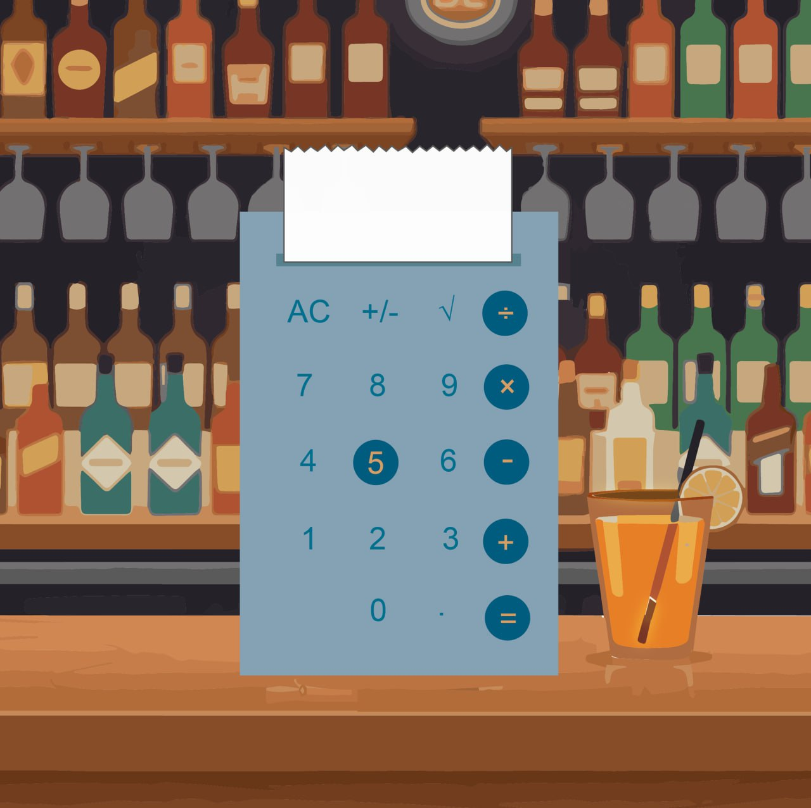

# 🧮 Калькулятор "Лонг Айленд"

Элегантный графический калькулятор с современным интерфейсом, разработанный на Python с использованием CustomTkinter.



## ✨ Особенности

- 🎨 **Стильный дизайн** - уникальный интерфейс с круглыми кнопками операций
- ⌨️ **Двойное управление** - работа как мышью, так и с клавиатуры
- ⚡ **Полный функционал** - все основные математические операции
- 🛡️ **Обработка ошибок** - корректная работа с математическими исключениями

## 🚀 Быстрый старт

### Предварительные требования

- Python 3.8 или выше
- pip (менеджер пакетов Python)

### Установка

1. **Клонируйте репозиторий**
```bash
git clone <url-репозитория>
cd calculator
```
2. **Установите зависимости**

```bash

pip install -r requirements.txt
```

3. **Запустите приложение**

```bash

cd source
python calculator.py
```

🎮 Руководство пользователя
Управление мышью

Цифровые клавиши:

    0-9 - ввод цифр

    . - десятичная точка

    +/- - смена знака

    AC - полная очистка

Операции:

    + - сложение

    - - вычитание

    × - умножение

    / - деление

    = - вычисление

    ⎷ - квадратный корень

Управление клавиатурой

    Цифры 0-9 - ввод чисел

    + - * / - математические операции

    Enter или = - выполнение расчета

    Escape - очистка (AC)

    . - десятичная точка

🛠 Технические детали
Архитектура проекта
```
calculator/
├── source/
│   └── calculator.py      # Основной код приложения
├── assets/
│   ├── calc.png          # Фоновое изображение
├── requirements.txt      # Зависимости проекта
└── README.md            # Документация
```
Ключевые технологии

    CustomTkinter - современная библиотека для создания GUI

    PIL (Pillow) - обработка и создание изображений

Цветовая схема

    Основной фон: #85a2b4 (сине-серый)

    Операции: #005c7e (темно-синий)

    Текст цифр: #006e8c (синий)

    Текст операций: #d29866 (золотистый)

🔧 Для разработчиков
Структура кода

Основной класс App наследуется от CTk и содержит:

    Элементы интерфейса - кнопки, метки, слайдеры

    Обработчики событий - клики, нажатия клавиш

    Логику калькулятора - вычисления, управление состоянием

Расширение функционала

Чтобы добавить новую операцию:

    Создайте метод-обработчик в классе App

    Добавьте соответствующую кнопку в интерфейс

    Реализуйте обработку в методе on_key_press

```python

def new_operation(self):
    # Логика новой операции
    pass
```
Обработка ошибок

Приложение включает два специальных окна ошибок:

    DivisionErrorWindow - для деления на ноль

    RootErrorWindow - для корня из отрицательного числа
